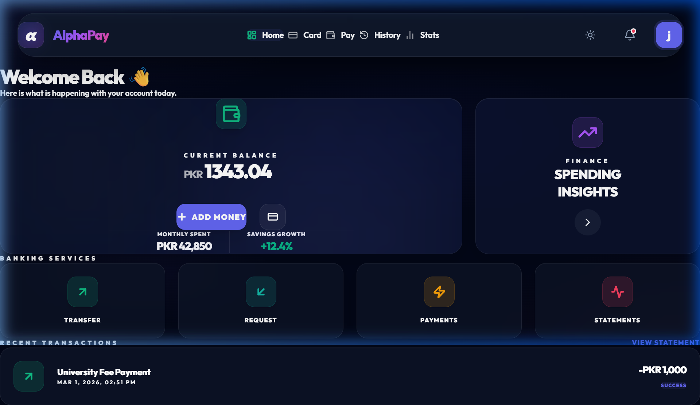
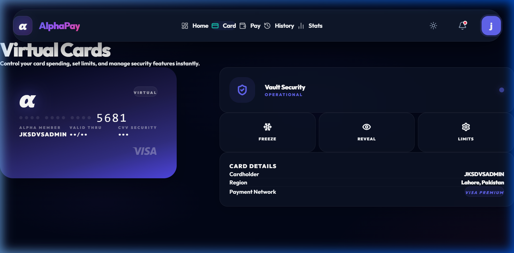
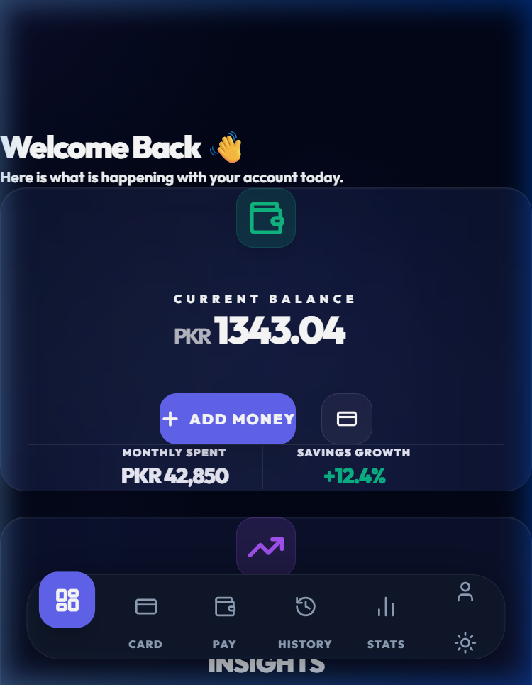
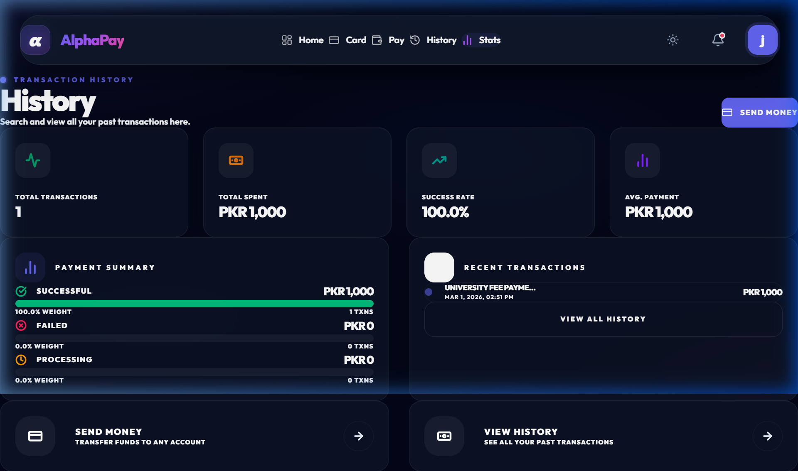

<div align="center">


# ⚡ AlphaPay
### Next-Gen University Payment Portal

**A premium, mobile-first simulated university fee payment portal built with React + Vite.**

[](https://reactjs.org/)
[](https://vitejs.dev/)
[](https://tailwindcss.com/)
[](https://www.framer.com/motion/)
[](LICENSE)

<p align="center">
  <a href="#-features">Features</a> •
  <a href="#-tech-stack">Tech Stack</a> •
  <a href="#-getting-started">Getting Started</a> •
  <a href="#-screenshots">Screenshots</a>
</p>

</div>

---

## ✨ Features

- 🌐 **Fluid Full-Width Interface** — Expansive, ultra-wide optimized layout (up to 1600px) for a truly desktop-premium experience.
- 📱 **Mobile-First Foundation** — Seamless parity between desktop and mobile with a custom floating navigation dock.
- 💳 **3D Interactive Virtual Cards** — Flip animation, EMV chip, and real-time preview with high-fidelity VISA branding.
- 💸 **Smart Transaction Intel** — Corrected directionality logic (Sent/Received) with click-to-view interactive digital receipts.
- 📊 **Cinematic Analytics** — High-performance animated charts for spending insights and success rates.
- 📋 **Advanced Ledger** — Fully searchable transaction table with responsive card views and detailed status tracking.
- 🎨 **Dark Mode Glassmorphism** — Premium aesthetics with deep space blacks, glowing neon emerald accents, and high-performance micro-interactions.

---

## 🛠️ Tech Stack

| Technology | Purpose |
| :--- | :--- |
| **React 19** | Modern UI Component Framework |
| **Vite 7** | Ultra-fast Build Tool & Dev Server |
| **Tailwind CSS 4** | Modern Utility-First Styling |
| **Framer Motion 12** | Cinematic Animations & Gestures |
| **React Router 7** | Robust Client-Side Routing |
| **Lucide React** | Premium Iconography |

---

## 🚀 Getting Started

### Prerequisites
- **Node.js** (v18.0.0 or higher)
- **npm** or **yarn**

### Installation

1. **Clone the repository**
   ```bash
   git clone https://github.com/Kashif-Khokhar/Alphapay.git
   cd Alphapay
   ```

2. **Install dependencies**
   ```bash
   npm install
   ```

3. **Launch the development server**
   ```bash
   npm run dev
   ```

The application will be live at `http://localhost:5173`.

---

## 📸 Screenshots

> [!NOTE]
> This is a **pure demonstration project**. All data is simulated, and no real financial transactions take place.

### 🖥️ Desktop Experience

| Dashboard | Virtual Cards |
| :---: | :---: |
|  |  |

### 📱 Mobile Experience & Analytics

| Mobile Dashboard | Transaction History |
| :---: | :---: |
|  |  |

---

## 📂 Project Structure

```text
src/
├── components/          # Reusable UI components (Cards, Forms, Nav)
├── pages/               # Page-level components (Dashboard, History, etc.)
├── services/            # Mock API & data simulation services
├── assets/              # Static assets and images
├── App.jsx              # Main application entry and routing
└── index.css            # Global styles and design tokens
```

---

## 📜 Available Scripts

- `npm run dev`: Starts the Vite development server.
- `npm run build`: Compiles the application for production.
- `npm run preview`: Locally previews the production build.
- `npm run lint`: Runs ESLint to check for code quality issues.

---

## 🛠️ Troubleshooting

**PowerShell Execution Policy Error (Windows)**
If you encounter a `PSSecurityException` error when running scripts like `npm run dev` in PowerShell on Windows, you may need to update your execution policy to allow local scripts. You can resolve this by running the following command in your PowerShell terminal:

```powershell
Set-ExecutionPolicy -ExecutionPolicy RemoteSigned -Scope CurrentUser
```

---

## 👤 Author

**Kashif Khokhar**
- GitHub: [@Kashif-Khokhar](https://github.com/Kashif-Khokhar)

---

<div align="center">
  Built with ❤️ for High-Performance UI Design · © 2026
</div>
